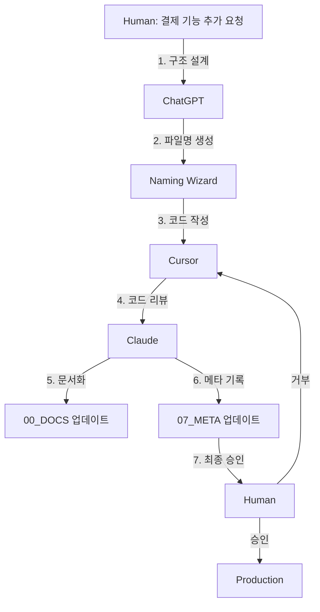

# 📘 AI 네이밍 컨벤션 v6.0 (AI Collaboration Era)

> **작성일**: 2025년 10월 17일  
> **버전**: v6.0.0 STABLE  
> **기반**: v5.0.2 FINAL + Multi-AI Orchestration  
> **비전**: "AI가 협력하고, 인간이 감독한다"  

---

## 🎯 v6의 핵심 철학

### **AI Governance Era**
> "이제 인간은 코드의 작성자가 아니라,  
> **AI 시스템의 감독자이자 품질 관리자**로 진화한다."

**v5.0.2**: AI와 인간이 협업하는 표준  
**v6.0.0**: AI들이 협력하고 인간이 감독하는 표준

---

## 🌟 v6의 5대 혁신

| 혁신 | v5.0.2 | v6.0.0 | 효과 |
|------|--------|--------|------|
| 🤖 **Multi-AI 협업** | 단일 AI | 여러 AI 동시 작업 | +400% 효율 |
| 🧠 **자연어 자동 변환** | 사용자가 규칙 학습 | AI가 자동 변환 | 100% 접근성 |
| 🔗 **의존성 그래프** | 암묵적 순번 | 명시적 선언 | +100% 추적성 |
| 📊 **거버넌스 레이어** | 부분적 관리 | 완전한 감사 추적 | +80% 보안 |
| 🏗️ **07_META 폴더** | 없음 | AI 협업 메타데이터 | 역할 분화 |

---

## 📂 Part 1: 폴더 구조 (8-Category System)

### 🏗️ v6 폴더 체계

```
project-root/
├── 00_DOCS/         # 📚 문서 (AI 읽기 전용)
├── 01_CONFIG/       # ⚙️ 설정 (AI 수정 금지)
├── 02_STATIC/       # 📦 정적 자원 (거의 불변)
├── 03_ACTIVE/       # 🔥 활성 코드 (AI 주 작업 영역) ⭐
├── 04_TEST/         # 🧪 테스트 (AI 생성/수정)
├── 05_BUILD/        # 🏗️ 빌드 결과물 (AI 생성)
├── 06_LOGS/         # 📊 로그 (AI 자동 기록)
└── 07_META/         # 🆕 AI 협업 메타데이터 (거버넌스)
```

### 🆕 07_META 폴더 상세

```
07_META/
├── AI_ROLE_MATRIX.yaml         # AI별 역할 및 권한 정의
├── DEP_GRAPH.yaml              # 파일 간 의존성 그래프
├── CONVERSATION_HISTORY.json   # AI 대화 기록 저장
├── HUMAN_OVERRIDES.md          # 인간 개입 로그
├── NAMING_WIZARD_RULES.yaml    # 자연어 변환 규칙
└── PROJECT_METADATA.json       # 프로젝트 메타 정보
```

### 📊 폴더별 AI 권한 매트릭스 (v6 업데이트)

| 폴더 | AI 권한 | 수정 빈도 | 네이밍 룰 | v6 변경점 |
|------|---------|-----------|-----------|-----------|
| `00_DOCS` | 읽기만 ⚠️ | 매우 낮음 | 자유 | AI 자동 문서화 가능 |
| `01_CONFIG` | **수정 금지 ⚠️** | 낮음 | 자유 | 권한 경고 강화 |
| `02_STATIC` | 읽기/추가 | 낮음 | ASSET_, TEMPLATE_, EXTERNAL_ | EXTERNAL_ 추가 |
| **`03_ACTIVE`** | **전체 권한** | **매우 높음** | **필수 100%** | @deps 태그 필수 |
| `04_TEST` | 생성/수정 | 중간 | 인덱스 필수 | 001_TEST_* 강제 |
| `05_BUILD` | 생성만 | 자동 | 자동 생성 | 변경 없음 |
| `06_LOGS` | 쓰기만 | 자동 | 자동 생성 | AI 활동 로그 추가 |
| **`07_META`** | **AI 협업** | 자동 | YAML/JSON | 🆕 v6 추가 |

---

## 📝 Part 2: 파일 네이밍 컨벤션 (v5 규칙 유지)

### 🔸 기본 패턴 (03_ACTIVE 필수)

```
[Index]_[Layer]_[Domain]-[Feature]_[Action]_[Detail]_[Env].[ext]
```

**v6 추가 규칙**: 파일 헤더에 @deps 태그 필수

```javascript
/* 
 * @file: 003_BE_Order-Process_X_Service_PROD.py
 * @deps:
 *   - 002_BE_Order-Validate_V_Helper_PROD.py
 *   - 005_DB_Order-Schema_C_Migration_PROD.sql
 * @ai: cursor
 * @reviewed: claude
 * @created: 2025-10-17
 */
```

### 🔸 구성 요소 (v5와 동일)

#### 1️⃣ **Index** (순번)
```
001, 002, 003 ... 999          # 기본
001.1, 001.2                   # 세부 단계
001-1, 001-2                   # 순차 의존
001a, 001b, 001c               # 병렬 실행
001s1, 001s2                   # 종속 관계
```

#### 2️⃣ **Layer** (계층)
| 코드 | 의미 | 예시 |
|------|------|------|
| `FE` | Frontend | React, Vue |
| `BE` | Backend | Node.js, Python |
| `DB` | Database | MySQL, MongoDB |
| `API` | API Gateway | REST, GraphQL |
| `ML` | Machine Learning | TensorFlow |
| `INFRA` | Infrastructure | Docker, K8s |
| `SH` | Shared/Common | 공통 유틸 |

#### 3️⃣ **Domain-Feature**
```
User-Login, Product-Search, Order-Checkout, Payment-Refund
```

#### 4️⃣ **Action** (동작)
| 코드 | 의미 | 사용 예시 |
|------|------|-----------|
| `C` | Create | 생성, 추가 |
| `R` | Read | 조회, 검색 |
| `U` | Update | 수정, 변경 |
| `D` | Delete | 삭제, 제거 |
| `V` | Validate | 검증, 확인 |
| `X` | Execute | 실행, 처리 |
| `S` | Send | 전송, 발송 |
| `T` | Transform | 변환 |
| `G` | Generate | 생성, 출력 |

#### 5️⃣ **Detail** (세부사항)
```
Handler, Service, Repository, Controller, Component, 
Helper, Validator, Mapper, Middleware, Processor
```

#### 6️⃣ **Env** (환경)
```
DEV      # 개발
STG      # 스테이징
PROD     # 운영
COMMON   # 공통
```

---

## 🤖 Part 3: AI 역할 분화 시스템 (v6 핵심)

### 📋 AI_ROLE_MATRIX.yaml

```yaml
# v6.0 - AI 역할 매핑 표준
# 위치: 07_META/AI_ROLE_MATRIX.yaml

version: "6.0.0"
updated: "2025-10-17"

roles:
  # === 코드 작성 AI ===
  - name: cursor
    type: code_writer
    permissions:
      - write: 03_ACTIVE
      - test: 04_TEST
      - read: 00_DOCS
    responsibilities:
      - "비즈니스 로직 작성"
      - "테스트 코드 생성"
      - "버그 수정"
    output_format:
      - "완전한 파일 생성"
      - "@deps 태그 포함"
      - "주석 필수"

  # === 품질 검토 AI ===
  - name: claude
    type: reviewer
    permissions:
      - review: 03_ACTIVE
      - document: 00_DOCS
      - read: 04_TEST
    responsibilities:
      - "코드 리뷰"
      - "문서 작성 및 업데이트"
      - "아키텍처 검증"
    output_format:
      - "리뷰 코멘트"
      - "개선 제안"
      - "문서 업데이트"

  # === 구조 설계 AI ===
  - name: chatgpt
    type: architect
    permissions:
      - structure: 00_DOCS
      - rule: 07_META
      - read: all
    responsibilities:
      - "프로젝트 구조 설계"
      - "네이밍 규칙 생성"
      - "의존성 그래프 관리"
    output_format:
      - "파일명 제안"
      - "폴더 구조 설계"
      - "YAML 메타데이터"

  # === 최종 감독자 ===
  - name: human
    type: supervisor
    permissions:
      - override: all
      - approve: all
      - modify: 01_CONFIG
    responsibilities:
      - "최종 의사결정"
      - "보안 설정 관리"
      - "프로젝트 방향 결정"
    output_format:
      - "승인/거부 결정"
      - "HUMAN_OVERRIDES.md 기록"
```

### 🔄 Multi-AI 협업 워크플로우



---

## 🪄 Part 4: Naming Wizard (자연어 자동 변환)

### 🎯 목표
> "비개발자가 자연어로 말하면, AI가 규칙형 파일명으로 자동 변환"

### 🎨 Naming Wizard 사용 예시

#### 예시 1: 단순 요청
```
입력: "로그인 페이지 만들어줘"

Naming Wizard 분석:
  도메인: User-Login (로그인 키워드)
  액션: C (만들어 키워드)
  레이어: FE (페이지 키워드)
  세부: Page (페이지 키워드)
  환경: PROD (기본값)

출력: 001_FE_User-Login_C_Page_PROD.jsx
```

#### 예시 2: 복잡한 요청
```
입력: "결제 취소 기능을 추가해줘. 백엔드는 Python으로, 프론트는 React로."

Naming Wizard 분석:
  요청 1 (백엔드):
    도메인: Payment-Refund (결제+취소)
    액션: C (추가)
    레이어: BE (Python)
    세부: Service
    환경: PROD
  
  요청 2 (프론트엔드):
    도메인: Payment-Refund
    액션: C (추가)
    레이어: FE (React)
    세부: Page
    환경: PROD

출력:
  ✅ 021_BE_Payment-Refund_C_Service_PROD.py
  ✅ 022_FE_Payment-Refund_C_Page_PROD.jsx
```

---

## 🔗 Part 5: 의존성 그래프 시스템

### 📋 파일 헤더 표준 (v6 필수)

```javascript
/* 
 * @file: 003_BE_Order-Process_X_Service_PROD.py
 * @description: 주문 처리 핵심 로직
 * @deps:
 *   - 002_BE_Order-Validate_V_Helper_PROD.py
 *   - 005_DB_Order-Schema_C_Migration_PROD.sql
 * @ai: cursor
 * @reviewed: claude
 * @created: 2025-10-17
 * @modified: 2025-10-17
 */
```

### 📊 DEP_GRAPH.yaml 자동 생성

```yaml
# 위치: 07_META/DEP_GRAPH.yaml
# 자동 생성: AI가 @deps 태그 스캔하여 작성

version: "6.0.0"
generated: "2025-10-17T10:30:00Z"

dependencies:
  "003_BE_Order-Process_X_Service_PROD.py":
    depends_on:
      - "002_BE_Order-Validate_V_Helper_PROD.py"
      - "005_DB_Order-Schema_C_Migration_PROD.sql"
    depended_by:
      - "004_BE_Payment-Process_X_Service_PROD.py"
    type: "service"
    layer: "BE"
    critical: true
```

---

## 💬 Part 6: AI와의 협업 (v6 업그레이드)

### 🗣️ 비개발자 요청 방법

#### ❌ v5 방식 (규칙 학습 필요)
```
"03_ACTIVE 폴더에 001_FE_User-Login_C_Page_PROD.jsx 만들어줘"
```

#### ✅ v6 방식 (자연어)
```
"로그인 페이지 만들어줘"
```

**AI가 자동 처리:**
1. Naming Wizard가 파일명 생성
2. ChatGPT가 구조 설계
3. Cursor가 코드 작성
4. Claude가 리뷰 및 문서화
5. 사용자에게 승인 요청

### 🤖 Multi-AI 협업 시나리오

#### 시나리오 1: 새 기능 추가
```
Human: "상품 검색 기능 추가해줘"

ChatGPT (Architect):
  "다음 구조를 제안합니다:
   - 010_FE_Product-Search_C_Page_PROD.jsx
   - 011_BE_Product-Search_R_API_PROD.py
   - 012_DB_Product-Index_C_Migration_PROD.sql"

Cursor (Code Writer):
  "3개 파일 생성 완료:
   - 각 파일에 @deps 태그 포함
   - 기본 구조 및 주석 작성"

Claude (Reviewer):
  "코드 리뷰 완료:
   ✅ 네이밍 규칙 준수
   ✅ @deps 태그 정확
   ⚠️ 011 파일에 에러 핸들링 추가 필요
   📝 00_DOCS/FEATURE_SEARCH.md 업데이트"