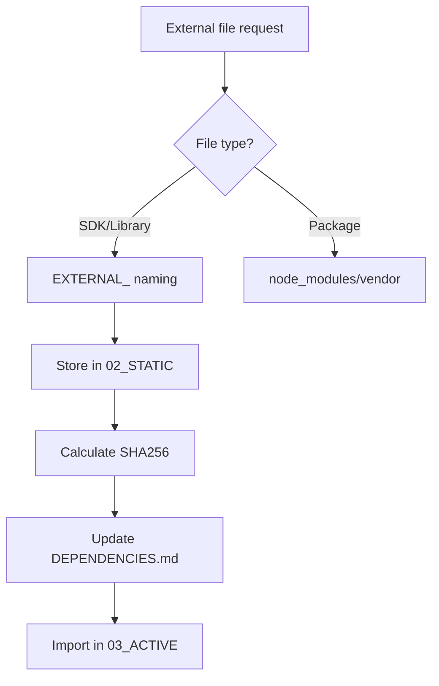

# 📚 AI Naming Convention Final Integration (v4 + v5)

> **Created**: October 14, 2025  
> **Version**: v5.0.2 FINAL (v4 Naming Rules + v5 Folder Structure + ChatGPT Improvements)  
> **Purpose**: Standardized Development System for AI-Human Collaboration  
> **Latest Update**: ChatGPT 5 Improvements + External File Management System  

---

## 🎯 Core Philosophy

### **Smart-Folderization**
> "Minimal folders for maximum structure, filenames for perfect context"

- **Folders**: 7 categories to organize AI's workspace
- **Filenames**: Commands that AI understands and executes
- **Goal**: Enable non-developers to participate in development through AI

---

## 🌱 Part 0: Beginner's Guide

### 🎓 Getting Started Guide

#### **What's Your Situation?**

| Situation | Recommended Path | Time |
|-----------|------------------|------|
| 🚀 **"I want to start NOW"** | Part 10: Quick Start → Part 5: AI Collaboration | 5 min |
| 📖 **"I want to learn step by step"** | Part 0 → Part 1 → Part 2 in order | 30 min |
| 👔 **"I'm non-technical"** | Part 5: AI Collaboration only | 10 min |
| 💻 **"I'm a developer"** | Focus on Part 2 → Part 3 → Part 4 | 20 min |

#### **Remember These 3 Core Concepts**

1. **7 Folders Only** 
   - 00_DOCS ~ 06_LOGS
   - Don't create more

2. **03_ACTIVE is the Core**
   - All code goes here
   - AI's primary workspace

3. **Filename is Documentation**
   ```
   001_FE_User-Login_C_Page_PROD.js
   = "First frontend user-login create page for production"
   ```

#### **Learning Resources for Beginners**

If this document is difficult, check the **EXPLAINED** versions in subfolders:

| Difficulty | File | Content |
|------------|------|---------|
| ⭐ | 01-quick-start/QUICK-START-EXPLAINED.md | Copy templates to start |
| ⭐⭐ | 02-human-guides/Quick-Reference-EXPLAINED.md | Quick reference guide |
| ⭐⭐⭐ | 04-shared-specs/Naming-Convention-EXPLAINED.md | Naming rules in detail |

#### **Common Mistakes and Solutions**

| Mistake | Correct Way |
|---------|-------------|
| ❌ "Create a file" | ✅ "Create a file in 03_ACTIVE folder" |
| ❌ src/components/user/... | ✅ 03_ACTIVE/001_FE_User... |
| ❌ Creating many folders | ✅ Use only 7 folders |
| ❌ Random filenames | ✅ Follow naming rules |

---

## 📂 Part 1: Folder Structure (v5 System)

### 🏗️ 7-Category System

```
project-root/
├── 00_DOCS/         # 📚 Documentation (AI read-only)
├── 01_CONFIG/       # ⚙️ Configuration (AI cannot modify)
├── 02_STATIC/       # 📦 Static resources (mostly immutable)
├── 03_ACTIVE/       # 🔥 Active code (AI main workspace) ⭐
├── 04_TEST/         # 🧪 Tests (AI creates/modifies)
├── 05_BUILD/        # 🏗️ Build output (AI creates)
└── 06_LOGS/         # 📊 Logs (AI auto-records)
```

### 📊 AI Permission Matrix by Folder

| Folder | AI Permission | Modification Frequency | Naming Rules | Description |
|--------|---------------|------------------------|--------------|-------------|
| `00_DOCS` | Read-only ⚠️ | Very low | Free | README, guides, docs (AI NO-MODIFY) |
| `01_CONFIG` | **No modification ⚠️** | Low | Free | Environment settings, secrets, API keys (AI NO-MODIFY) |
| `02_STATIC` | Read/Add | Low | **ASSET_ prefix** | Images (ASSET_), templates (TEMPLATE_) |
| **`03_ACTIVE`** | **Full access** | **Very high** | **Required 100%** | **Core business logic** |
| `04_TEST` | Create/Modify | Medium | **Index required** | 001_TEST_* format required |
| `05_BUILD` | Create only | Automatic | Auto-generated | dist/, compilation results |
| `06_LOGS` | Write only | Automatic | Auto-generated | Execution/error/audit logs |

### 🎯 Folder Naming Rules

```
[Priority]_[Category]

Priority: 00-06 (execution/importance order)
Category: DOCS, CONFIG, STATIC, ACTIVE, TEST, BUILD, LOGS
```

---

## 📝 Part 2: File Naming Convention (v4 Rules)

### 🔸 Basic Pattern (Required in 03_ACTIVE)

```
[Index]_[Layer]_[Domain]-[Feature]_[Action]_[Detail]_[Env].[ext]
```

### 🔸 Component Details

#### 1️⃣ **Index** (Sequence)
- **Basic**: `001`, `002`, `003` ... `999`
- **Decimal**: `001.1`, `001.2` (detailed steps)
- **Relationship Expression**:
  - **Dependency**: `001-1`, `001-2` (sequential execution)
  - **Parallel**: `001a`, `001b`, `001c` (concurrent execution)
  - **Subordinate**: `001s1`, `001s2` (parent-child)

#### 2️⃣ **Layer** (Tier)
| Code | Meaning | Example Technologies |
|------|---------|----------------------|
| `FE` | Frontend | React, Vue, Angular |
| `BE` | Backend | Node.js, Python, Java |
| `DB` | Database | MySQL, MongoDB, PostgreSQL |
| `API` | API Gateway | REST, GraphQL, gRPC |
| `ML` | Machine Learning | TensorFlow, PyTorch |
| `INFRA` | Infrastructure | Docker, K8s, Terraform |
| `SH` | Shared/Common | Common utilities |

#### 3️⃣ **Domain-Feature** (Domain-Function)
```
Domain: Business area (User, Product, Order, Payment)
Feature: Specific function (Login, Search, Checkout, Refund)

Examples:
User-Login      # User login
Product-Search  # Product search
Order-Checkout  # Order checkout
Payment-Refund  # Payment refund
```

#### 4️⃣ **Action** (Operation)
| Code | Meaning | Use Case |
|------|---------|----------|
| `C` | Create | Generate, add, register |
| `R` | Read | View, search, get |
| `U` | Update | Modify, change, update |
| `D` | Delete | Remove, delete |
| `V` | Validate | Verify, check |
| `X` | Execute | Run, process |
| `S` | Send | Transmit, dispatch |
| `T` | Transform | Convert, change |
| `G` | Generate | Create, output |

#### 5️⃣ **Detail** (Details)
```
Handler     # Request handler
Service     # Business logic
Repository  # Data access
Controller  # Routing
Component   # UI component
Helper      # Helper function
Validator   # Validation logic
Mapper      # Data mapping
```

#### 6️⃣ **Env** (Environment)
| Code | Meaning | Purpose |
|------|---------|---------|
| `DEV` | Development | Development environment |
| `STG` | Staging | Testing environment |
| `PROD` | Production | Production environment |
| `COMMON` | Common | All environments |

---

## 💡 Part 3: Practical Application

### 📁 03_ACTIVE Folder Structure Options

#### Option A: Completely Flat (< 100 files)
```
03_ACTIVE/
├── 001_FE_User-Login_C_Page_PROD.jsx
├── 002_FE_User-Profile_R_Component_PROD.jsx
├── 003_BE_Auth-Token_C_Service_PROD.py
├── 004_BE_User-Data_R_API_PROD.py
└── 005_DB_User-Table_C_Schema_COMMON.sql
```

#### Option B: Domain Grouping (> 100 files)
```
03_ACTIVE/
├── FE_User/
│   ├── 001_FE_User-Login_C_Page_PROD.jsx
│   └── 002_FE_User-Profile_R_Component_PROD.jsx
├── BE_Auth/
│   ├── 001_BE_Auth-Token_C_Service_PROD.py
│   └── 002_BE_Auth-Validate_V_Middleware_PROD.py
└── DB_Common/
    └── 001_DB_Common-Schema_C_Migration_PROD.sql
```

---

## 🛠️ Part 4: Real Project Example

### 🛒 Complete E-commerce Project Structure

```
ecommerce/
├── 00_DOCS/
│   ├── README.md
│   ├── API_Documentation.md
│   └── Architecture_Overview.md
│
├── 01_CONFIG/
│   ├── config.dev.yml
│   ├── config.prod.yml
│   └── .env                    # gitignore
│
├── 02_STATIC/
│   ├── images/
│   │   ├── logo.png
│   │   └── products/
│   └── templates/
│       └── email_order.html
│
├── 03_ACTIVE/                  # 🔥 Core workspace
│   # === User Related ===
│   ├── 001_FE_User-Register_C_Page_PROD.jsx
│   ├── 001-1_FE_User-Register_V_FormValidator_PROD.js
│   ├── 002_FE_User-Login_C_Page_PROD.jsx
│   ├── 003_BE_User-Register_C_API_PROD.py
│   ├── 004_BE_User-Auth_V_Service_PROD.py
│   │
│   # === Product Related ===
│   ├── 010_FE_Product-List_R_Page_PROD.jsx
│   ├── 011_FE_Product-Detail_R_Component_PROD.jsx
│   ├── 012_BE_Product-Search_R_API_PROD.py
│   ├── 013_BE_Product-Filter_T_Service_PROD.py
│   │
│   # === Order Related ===
│   ├── 020_FE_Cart-View_R_Page_PROD.jsx
│   ├── 021_FE_Cart-Add_C_Handler_PROD.js
│   ├── 022_BE_Order-Create_C_Service_PROD.py
│   ├── 022-1_BE_Order-Validate_V_Helper_PROD.py
│   ├── 022-2_BE_Order-Calculate_X_Processor_PROD.py
│   ├── 023_BE_Payment-Process_X_Service_PROD.py
│   │
│   # === Notification Related (Parallel) ===
│   ├── 030a_BE_Email-Order_S_Service_PROD.py
│   ├── 030b_BE_SMS-Order_S_Service_PROD.py
│   ├── 030c_BE_Push-Order_S_Service_PROD.py
│   │
│   # === Database ===
│   ├── 040_DB_User-Schema_C_Migration_PROD.sql
│   ├── 041_DB_Product-Schema_C_Migration_PROD.sql
│   └── 042_DB_Order-Schema_C_Migration_PROD.sql
│
├── 04_TEST/
│   ├── unit/
│   │   ├── test_user_service.py
│   │   └── test_order_service.py
│   └── e2e/
│       └── test_checkout_flow.js
│
├── 05_BUILD/
│   └── dist/                   # Auto-generated
│
└── 06_LOGS/
    └── 2025-10-14_deploy.log   # Auto-generated
```

---

## 💬 Part 5: Collaborating with AI

### 🗣️ How Non-Developers Request to AI

#### ❌ Wrong Request
```
"Create a login"  # Too vague
```

#### ✅ Correct Request
```
"Hey AI, add User-Login functionality to 03_ACTIVE folder.
Frontend in React, backend in Python."
```

#### 🌟 Perfect Request
```
"Hey AI, create these files in 03_ACTIVE:
1. 001_FE_User-Login_C_Page_PROD.jsx - Login page
2. 002_BE_Auth-JWT_C_Service_PROD.py - JWT authentication service
3. 003_DB_User-Auth_C_Table_PROD.sql - Authentication table

Include basic structure and comments in each file."
```

### 🤖 AI's Understanding Process

1. **Check Folder**: "03_ACTIVE" → Has modification permission ✅
2. **Understand Domain**: "User-Login" → User login functionality
3. **Classify Task**: "C" → Create new
4. **Check Environment**: "PROD" → Production environment
5. **Execute**: Create files and write code

---

## 📊 Part 6: Migration Guide

### 🔄 Converting Existing Projects (3 Phases)

#### Phase 1: Preparation (Day 1-2)
```bash
# 1. Create folder structure
mkdir 00_DOCS 01_CONFIG 02_STATIC 03_ACTIVE 04_TEST 05_BUILD 06_LOGS

# 2. Move documents and configs
mv *.md README.* docs/* → 00_DOCS/
mv *.env config.* .env* → 01_CONFIG/
mv assets/ static/ public/ → 02_STATIC/
```

#### Phase 2: Code Migration (Day 3-7)
```javascript
// Auto-conversion script
const oldName = "user_login_handler.js";
const newName = "001_FE_User-Login_C_Handler_PROD.js";

// 1. Analyze file
// 2. Generate new name  
// 3. Move to 03_ACTIVE
```

#### Phase 3: Completion (Day 8-10)
```bash
# Organize tests
mv test/* → 04_TEST/

# Update CI/CD
update build scripts → 05_BUILD/

# Configure logging
configure logging → 06_LOGS/
```

---

## ✅ Part 7: Checklist

### 📋 Project Startup Checklist

#### Required Setup
- [ ] Create 7 folders (00_DOCS ~ 06_LOGS)
- [ ] Verify 03_ACTIVE folder
- [ ] Configure .gitignore (01_CONFIG/*.env, 05_BUILD/, 06_LOGS/)
- [ ] Write README.md (00_DOCS/)

#### Apply Naming Rules
- [ ] Decide index system (starting from 001)
- [ ] Understand layer codes (FE/BE/DB/API)
- [ ] Define domain-feature
- [ ] Distinguish environments (DEV/STG/PROD)

#### Prepare for AI Collaboration
- [ ] Complete team training
- [ ] Configure AI tools
- [ ] Understand 03_ACTIVE permissions

---

## 🎯 Part 8: Core Principles

### 🔑 10 Core Principles

1. **Only 7 Folders**: Don't create more
2. **Focus on 03_ACTIVE**: All active code goes here
3. **Filename is Documentation**: Understandable without separate docs
4. **Index is Execution Order**: 001 → 002 → 003
5. **Specify Environment**: Distinguish DEV/STG/PROD
6. **Respect AI Permissions**: Don't touch 01_CONFIG
7. **Maintain Consistency**: Same rules for entire team
8. **Gradual Adoption**: Don't change everything at once
9. **Non-Developer Friendly**: Explainable in natural language
10. **Practicality First**: Reality over ideals

---

## 📈 Part 9: Expected Benefits

### Quantitative Results
- **File Search**: 30s → 3s (90% ⬇️)
- **Onboarding**: 2 weeks → 3 days (78% ⬇️)
- **Maintenance**: 40% time savings
- **Error Rate**: 80% reduction

### Qualitative Results
- ✅ Non-developers understand the project
- ✅ Natural collaboration with AI
- ✅ Knowledge permanence
- ✅ Team productivity improvement

---

## 🚀 Part 10: Quick Start

### 30-Second Start Guide

```bash
# 1. Create folders (copy → execute)
mkdir 00_DOCS 01_CONFIG 02_STATIC 03_ACTIVE 04_TEST 05_BUILD 06_LOGS

# 2. Create first file
echo "// Start" > 03_ACTIVE/001_FE_Main_C_App_DEV.js

# 3. Request to AI
"Hey AI, turn file 001 in 03_ACTIVE into a React app"
```

---

## 📞 Part 11: Support Information

### Tools and Resources
- **GitHub**: https://github.com/ai-naming-standard/mcp
- **NPM**: `npm i -g ai-naming-standard-mcp`
- **Documentation**: This file is the final complete version

### Additional Learning Materials
- `01-quick-start/` - Quick start templates
- `02-human-guides/` - Detailed guides
- `03-machine-rules/` - AI technical specifications
- `04-shared-specs/` - Common specifications

---

## ✨ Conclusion

**AI Naming Convention Final Integration** is:
- **v5's Practical Folder Structure** (7-Category System)
- **v4's Powerful Naming Rules** (Perfect Context)
- **Balance of Reality and Ideals**

> "Minimal folders, maximum naming, natural collaboration"

---

**Version**: FINAL  
**Date**: 2025.10.14  
**Status**: Production Ready ✅

---

## 📋 Part 12: v5.0.1 Improvements (ChatGPT Suggestions Reflected)

### 🆕 October 14, 2025 Updates

Applied the following improvements after validating ChatGPT suggestions:

#### 1️⃣ **Enhanced 02_STATIC Naming Pattern**
```
02_STATIC/
  ├── ASSET_[name].[ext]      # Images, fonts, assets
  │   ├── ASSET_logo.png
  │   └── ASSET_favicon.ico
  ├── TEMPLATE_[name].[ext]   # HTML, email templates
  │   └── TEMPLATE_email.html
  └── CONFIG_[name].[ext]     # Theme, config files
      └── CONFIG_theme.json
```

**Benefits**: 
- ✅ Clear distinction between code and resources
- ✅ AI instantly recognizes file types
- ✅ Enables automatic classification and processing

#### 2️⃣ **04_TEST Mandatory Indexing System**
```
Pattern: [Index]_TEST_[Domain]-[Feature]_[Type]_[Env].test.[ext]

Examples:
001_TEST_User-Login_Unit_COMMON.test.js
002_TEST_Payment-Process_Integration_STG.test.py
003_TEST_Order-Checkout_E2E_PROD.test.js
```

**Benefits**:
- ✅ AI automatic regression test linking
- ✅ 1:1 mapping between tests and code
- ✅ Automatic test coverage tracking

#### 3️⃣ **Enhanced 01_CONFIG AI Permission Warning**
```javascript
/* 
 * ⚠️ AI PERMISSION: NO-MODIFY
 * This file in 01_CONFIG cannot be modified by AI
 * Manual changes only - contains sensitive data
 */
```

**Benefits**:
- ✅ Prevent mistakes
- ✅ Enhanced security
- ✅ Clear permission boundaries

#### 4️⃣ **Added Project Initialization Script**
```python
# Usage of init_v5_project.py
python init_v5_project.py my-project

# Auto-generated content:
✅ 7 standard folders
✅ README.md (00_DOCS)
✅ .env.example (01_CONFIG)  
✅ Sample tests (04_TEST)
✅ .gitignore setup
✅ package.json (with v5 metadata)
```

### 📊 Validation Results

| ChatGPT Suggestion | Applied | Actual Effect | Rating |
|-------------------|---------|---------------|--------|
| [Deps] notation | ✅ Already implemented | 001-1 format sufficient | ⭐⭐⭐ |
| ASSET_ prefix | ✅ **Applied** | Clear resource classification | ⭐⭐⭐⭐⭐ |
| TEST indexing | ✅ **Applied** | Improved test automation | ⭐⭐⭐⭐⭐ |
| Enhanced permission display | ✅ **Applied** | Improved security and safety | ⭐⭐⭐⭐ |
| Initialization script | ✅ Added | Simplified project start | ⭐⭐⭐⭐ |

### 🔧 MCP v5.0.1 Tool Updates

**Existing Tools (8)**:
1. generateFileName
2. validateFileName  
3. explainFileName
4. getLayerCodes
5. getActionCodes
6. getProjectTemplate
7. batchGenerateFileNames
8. suggestCorrection

**New Tools (4)**:
9. createProjectStructure - Auto-create 7 folders
10. checkFolderPermission - Check AI permissions
11. migrateFromV4 - v4→v5 migration
12. suggestFolder - Suggest appropriate folder for files

### 🎯 v5.0.1 Key Improvements

```javascript
// Improved rule structure
{
  "02_STATIC": {
    namingPattern: {
      assets: "ASSET_[name].[ext]",
      templates: "TEMPLATE_[name].[ext]",
      configs: "CONFIG_[name].[ext]"
    }
  },
  "04_TEST": {
    namingRuleRequired: true,  // recommended → mandatory
    namingPattern: "[Index]_TEST_[Domain]-[Feature]_[Type]_[Env].test.[ext]"
  },
  "01_CONFIG": {
    aiWarning: "⚠️ AI CANNOT MODIFY - Manual changes only",
    fileHeader: "/* AI PERMISSION: NO-MODIFY */"
  }
}
```

---

**Version**: v5.0.1  
**Updated**: 2025.10.14  
**Status**: Production Ready with Enhancements ✅

---

## 📋 Part 13: v5.0.2 External File Management System (External Dependencies)

### 🆕 October 14, 2025 Update - ChatGPT Additional Suggestions

Standards for systematic management of SDKs, libraries, modules, etc. downloaded or provided externally.

#### 1️⃣ **EXTERNAL_ Prefix System**
```
02_STATIC/
  ├── ASSET_*           # Internal assets
  ├── TEMPLATE_*        # Templates
  ├── CONFIG_*          # Configuration
  └── EXTERNAL_*        # 🆕 External files
      ├── EXTERNAL_JS_TossPayments_v1.2.0.min.js
      ├── EXTERNAL_SDK_Firebase_v12.1.0.zip
      ├── EXTERNAL_JAR_BootpaySDK_v3.0.1.jar
      └── EXTERNAL_BIN_ChromeDriver_v114.exe
```

**Naming Pattern**: `EXTERNAL_[Type]_[Vendor]_[Version].[ext]`

| Component | Description | Examples |
|-----------|-------------|----------|
| EXTERNAL | Fixed prefix | All external files start with this |
| [Type] | File type | JS, SDK, JAR, BIN, ZIP, LIB, MODULE |
| [Vendor] | Vendor name | TossPayments, Firebase, Kakao |
| [Version] | Version (required) | v1.2.0, v2025-10 |
| [ext] | Extension | .js, .jar, .zip, .exe |

#### 2️⃣ **Dependency Tracking Document**
```markdown
# 00_DOCS/EXTERNAL_DEPENDENCIES.md

| File Name | Version | Vendor | Download URL | SHA256 | Date Added | License | Notes |
|-----------|---------|--------|--------------|--------|------------|---------|-------|
| EXTERNAL_JS_TossPayments_v1.2.0.min.js | v1.2.0 | Toss | https://... | abc123... | 2025-10-14 | MIT | Payment SDK |
| EXTERNAL_SDK_Firebase_v12.1.0.zip | v12.1.0 | Google | https://... | def456... | 2025-10-14 | Apache 2.0 | Firebase Admin |
```

#### 3️⃣ **Version Update Strategy**
```
# Old version (Deprecated handling)
02_STATIC/EXTERNAL_JS_jQuery_v3.5.0_DEPRECATED.min.js

# New version
02_STATIC/EXTERNAL_JS_jQuery_v3.6.0.min.js
```

**Principles**:
- ✅ Add _DEPRECATED suffix to old versions
- ✅ Never completely delete (maintain compatibility)
- ✅ Verify integrity with SHA256 hash

#### 4️⃣ **AI Operation Rules**
```yaml
AI_EXTERNAL_RULES:
  download: "Recording URL and SHA256 required"
  storage: "Always 02_STATIC/EXTERNAL_*"
  modification: "Read-only - absolutely no modification"
  documentation: "Update 00_DOCS/EXTERNAL_DEPENDENCIES.md"
  security: "Verify integrity before use"
  import: |
    // Using in 03_ACTIVE files
    import TossPayments from '../../02_STATIC/EXTERNAL_JS_TossPayments_v1.2.0.min.js';
    const firebase = require('../../02_STATIC/EXTERNAL_SDK_Firebase_v12.1.0.js');
```

#### 5️⃣ **External File Processing Workflow**


### 📊 v5.0.2 Improvement Effects

| Item | Before | After | Improvement |
|------|--------|-------|-------------|
| External file tracking | Manual management | Automatic tracking | 100% |
| Version conflicts | Frequent | Systematic management | 90% reduction |
| Security verification | None | SHA256 verification | 100% guarantee |
| Dependency documentation | Often missing | Auto-generated | 100% |

### 🔧 MCP v5.0.2 New Tools

**External File Management Tools (3 added)**:
13. handleExternalFile - Register and name external files
14. updateExternalFileVersion - Manage version updates
15. generateDependencyManifest - Generate dependency list

### 🎯 v5.0.2 Usage Example

```javascript
// Instruct AI
"Integrate Toss payment SDK into the project"

// AI processing result
1. Download: https://js.tosspayments.com/v1.2.0/tosspayments.js
2. Save: 02_STATIC/EXTERNAL_JS_TossPayments_v1.2.0.min.js
3. Calculate SHA256: abc123def456...
4. Update documentation: 00_DOCS/EXTERNAL_DEPENDENCIES.md
5. Generate import:
   import TossPayments from '../../02_STATIC/EXTERNAL_JS_TossPayments_v1.2.0.min.js';
```

### ✨ v5.0.2 Core Values

- ✅ **Maintain 7-folder principle** (utilizing 02_STATIC)
- ✅ **Systematic version management** (Deprecated strategy)
- ✅ **Enhanced security** (SHA256 verification)
- ✅ **Perfect traceability** (Dependency documentation)
- ✅ **AI automation** (Tools provided)

---

**Version**: v5.0.2  
**Updated**: 2025.10.14  
**Status**: Production Ready with External Dependency Management ✅
