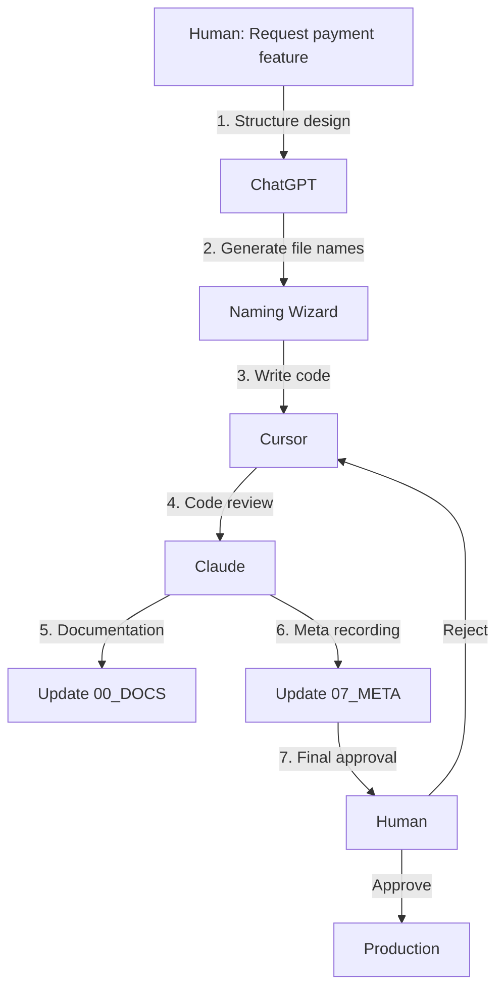

# 📘 AI Naming Convention v6.0 (AI Collaboration Era)

> **Date**: October 17, 2025  
> **Version**: v6.0.0 STABLE  
> **Based on**: v5.0.2 FINAL + Multi-AI Orchestration  
> **Vision**: "AIs collaborate, Humans supervise"  

---

## 🎯 Core Philosophy of v6

### **AI Governance Era**
> "Humans are no longer code writers,  
> but **supervisors and quality managers** of AI systems."

**v5.0.2**: Standards for AI and human collaboration  
**v6.0.0**: Standards for AI collaboration supervised by humans

---

## 🌟 5 Major Innovations in v6

| Innovation | v5.0.2 | v6.0.0 | Impact |
|------------|--------|--------|--------|
| 🤖 **Multi-AI Collaboration** | Single AI | Multiple AIs working simultaneously | +400% efficiency |
| 🧠 **Natural Language Conversion** | Users learn rules | AI auto-converts | 100% accessibility |
| 🔗 **Dependency Graph** | Implicit numbering | Explicit declaration | +100% traceability |
| 📊 **Governance Layer** | Partial management | Complete audit trail | +80% security |
| 🏗️ **07_META Folder** | None | AI collaboration metadata | Role differentiation |

---

## 📂 Part 1: Folder Structure (8-Category System)

### 🏗️ v6 Folder System

```
project-root/
├── 00_DOCS/         # 📚 Documentation (AI read-only)
├── 01_CONFIG/       # ⚙️ Configuration (AI cannot modify)
├── 02_STATIC/       # 📦 Static resources (nearly immutable)
├── 03_ACTIVE/       # 🔥 Active code (AI main work area) ⭐
├── 04_TEST/         # 🧪 Tests (AI generate/modify)
├── 05_BUILD/        # 🏗️ Build artifacts (AI generated)
├── 06_LOGS/         # 📊 Logs (AI auto-record)
└── 07_META/         # 🆕 AI collaboration metadata (governance)
```

### 🆕 07_META Folder Details

```
07_META/
├── AI_ROLE_MATRIX.yaml         # AI role and permission definitions
├── DEP_GRAPH.yaml              # Inter-file dependency graph
├── CONVERSATION_HISTORY.json   # AI conversation history
├── HUMAN_OVERRIDES.md          # Human intervention log
├── NAMING_WIZARD_RULES.yaml    # Natural language conversion rules
└── PROJECT_METADATA.json       # Project metadata
```

### 📊 AI Permission Matrix by Folder (v6 Update)

| Folder | AI Permission | Modification Frequency | Naming Rules | v6 Changes |
|--------|---------------|------------------------|--------------|------------|
| `00_DOCS` | Read-only ⚠️ | Very Low | Free | AI auto-documentation enabled |
| `01_CONFIG` | **Cannot Modify ⚠️** | Low | Free | Enhanced permission warnings |
| `02_STATIC` | Read/Add | Low | ASSET_, TEMPLATE_, EXTERNAL_ | EXTERNAL_ added |
| **`03_ACTIVE`** | **Full Access** | **Very High** | **Required 100%** | @deps tag mandatory |
| `04_TEST` | Create/Modify | Medium | Index required | 001_TEST_* enforced |
| `05_BUILD` | Create only | Automatic | Auto-generated | No changes |
| `06_LOGS` | Write only | Automatic | Auto-generated | AI activity logs added |
| **`07_META`** | **AI Collaboration** | Automatic | YAML/JSON | 🆕 v6 addition |

---

## 📝 Part 2: File Naming Convention (v5 Rules Maintained)

### 🔸 Basic Pattern (03_ACTIVE mandatory)

```
[Index]_[Layer]_[Domain]-[Feature]_[Action]_[Detail]_[Env].[ext]
```

**v6 Additional Rule**: @deps tag mandatory in file header

```javascript
/* 
 * @file: 003_BE_Order-Process_X_Service_PROD.py
 * @deps:
 *   - 002_BE_Order-Validate_V_Helper_PROD.py
 *   - 005_DB_Order-Schema_C_Migration_PROD.sql
 * @ai: cursor
 * @reviewed: claude
 * @created: 2025-10-17
 */
```

### 🔸 Components (Same as v5)

#### 1️⃣ **Index** (Sequence)
```
001, 002, 003 ... 999          # Basic
001.1, 001.2                   # Sub-steps
001-1, 001-2                   # Sequential dependency
001a, 001b, 001c               # Parallel execution
001s1, 001s2                   # Dependency relationship
```

#### 2️⃣ **Layer** (Architecture Layer)
| Code | Meaning | Example |
|------|---------|---------|
| `FE` | Frontend | React, Vue |
| `BE` | Backend | Node.js, Python |
| `DB` | Database | MySQL, MongoDB |
| `API` | API Gateway | REST, GraphQL |
| `ML` | Machine Learning | TensorFlow |
| `INFRA` | Infrastructure | Docker, K8s |
| `SH` | Shared/Common | Common utilities |

#### 3️⃣ **Domain-Feature**
```
User-Login, Product-Search, Order-Checkout, Payment-Refund
```

#### 4️⃣ **Action** (Operation)
| Code | Meaning | Use Case |
|------|---------|----------|
| `C` | Create | Create, add |
| `R` | Read | Retrieve, search |
| `U` | Update | Modify, change |
| `D` | Delete | Remove, delete |
| `V` | Validate | Verify, check |
| `X` | Execute | Run, process |
| `S` | Send | Transmit, dispatch |
| `T` | Transform | Convert |
| `G` | Generate | Generate, output |

#### 5️⃣ **Detail** (Specifics)
```
Handler, Service, Repository, Controller, Component, 
Helper, Validator, Mapper, Middleware, Processor
```

#### 6️⃣ **Env** (Environment)
```
DEV      # Development
STG      # Staging
PROD     # Production
COMMON   # Common
```

---

## 🤖 Part 3: AI Role Differentiation System (v6 Core)

### 📋 AI_ROLE_MATRIX.yaml

```yaml
# v6.0 - AI Role Mapping Standard
# Location: 07_META/AI_ROLE_MATRIX.yaml

version: "6.0.0"
updated: "2025-10-17"

roles:
  # === Code Writer AI ===
  - name: cursor
    type: code_writer
    permissions:
      - write: 03_ACTIVE
      - test: 04_TEST
      - read: 00_DOCS
    responsibilities:
      - "Write business logic"
      - "Generate test code"
      - "Fix bugs"
    output_format:
      - "Generate complete files"
      - "Include @deps tag"
      - "Comments required"

  # === Reviewer AI ===
  - name: claude
    type: reviewer
    permissions:
      - review: 03_ACTIVE
      - document: 00_DOCS
      - read: 04_TEST
    responsibilities:
      - "Code review"
      - "Write and update documentation"
      - "Architecture validation"
    output_format:
      - "Review comments"
      - "Improvement suggestions"
      - "Documentation updates"

  # === Architect AI ===
  - name: chatgpt
    type: architect
    permissions:
      - structure: 00_DOCS
      - rule: 07_META
      - read: all
    responsibilities:
      - "Project structure design"
      - "Naming rule generation"
      - "Dependency graph management"
    output_format:
      - "File name suggestions"
      - "Folder structure design"
      - "YAML metadata"

  # === Final Supervisor ===
  - name: human
    type: supervisor
    permissions:
      - override: all
      - approve: all
      - modify: 01_CONFIG
    responsibilities:
      - "Final decision-making"
      - "Security configuration management"
      - "Project direction determination"
    output_format:
      - "Approval/rejection decisions"
      - "HUMAN_OVERRIDES.md records"
```

### 🔄 Multi-AI Collaboration Workflow



---

## 🪄 Part 4: Naming Wizard (Natural Language Auto-conversion)

### 🎯 Goal
> "Non-developers speak in natural language, AI auto-converts to rule-based file names"

### 🎨 Naming Wizard Usage Examples

#### Example 1: Simple Request
```
Input: "Create a login page"

Naming Wizard Analysis:
  Domain: User-Login (login keyword)
  Action: C (create keyword)
  Layer: FE (page keyword)
  Detail: Page (page keyword)
  Env: PROD (default)

Output: 001_FE_User-Login_C_Page_PROD.jsx
```

#### Example 2: Complex Request
```
Input: "Add payment refund feature. Backend in Python, frontend in React."

Naming Wizard Analysis:
  Request 1 (Backend):
    Domain: Payment-Refund (payment+refund)
    Action: C (add)
    Layer: BE (Python)
    Detail: Service
    Env: PROD
  
  Request 2 (Frontend):
    Domain: Payment-Refund
    Action: C (add)
    Layer: FE (React)
    Detail: Page
    Env: PROD

Output:
  ✅ 021_BE_Payment-Refund_C_Service_PROD.py
  ✅ 022_FE_Payment-Refund_C_Page_PROD.jsx
```

---

## 🔗 Part 5: Dependency Graph System

### 📋 File Header Standard (v6 Mandatory)

```javascript
/* 
 * @file: 003_BE_Order-Process_X_Service_PROD.py
 * @description: Core order processing logic
 * @deps:
 *   - 002_BE_Order-Validate_V_Helper_PROD.py
 *   - 005_DB_Order-Schema_C_Migration_PROD.sql
 * @ai: cursor
 * @reviewed: claude
 * @created: 2025-10-17
 * @modified: 2025-10-17
 */
```

### 📊 DEP_GRAPH.yaml Auto-generation

```yaml
# Location: 07_META/DEP_GRAPH.yaml
# Auto-generated: AI scans @deps tags to generate

version: "6.0.0"
generated: "2025-10-17T10:30:00Z"

dependencies:
  "003_BE_Order-Process_X_Service_PROD.py":
    depends_on:
      - "002_BE_Order-Validate_V_Helper_PROD.py"
      - "005_DB_Order-Schema_C_Migration_PROD.sql"
    depended_by:
      - "004_BE_Payment-Process_X_Service_PROD.py"
    type: "service"
    layer: "BE"
    critical: true
```

---

## 💬 Part 6: Collaboration with AI (v6 Upgrade)

### 🗣️ How Non-developers Request

#### ❌ v5 Method (Rules learning required)
```
"Create 001_FE_User-Login_C_Page_PROD.jsx in 03_ACTIVE folder"
```

#### ✅ v6 Method (Natural language)
```
"Create a login page"
```

**AI Auto-processes:**
1. Naming Wizard generates file name
2. ChatGPT designs structure
3. Cursor writes code
4. Claude reviews and documents
5. Request approval from user

### 🤖 Multi-AI Collaboration Scenarios

#### Scenario 1: Adding New Feature
```
Human: "Add product search feature"

ChatGPT (Architect):
  "Suggesting the following structure:
   - 010_FE_Product-Search_C_Page_PROD.jsx
   - 011_BE_Product-Search_R_API_PROD.py
   - 012_DB_Product-Index_C_Migration_PROD.sql"

Cursor (Code Writer):
  "3 files created:
   - Included @deps tags in each file
   - Basic structure and comments written"

Claude (Reviewer):
  "Code review complete:
   ✅ Naming conventions followed
   ✅ @deps tags accurate
   ⚠️ Need error handling in file 011
   📝 Updated 00_DOCS/FEATURE_SEARCH.md"

Human (Supervisor):
  "Approved. Deploy to production."
```

---

## 📊 Part 7: Governance & Audit Trail

### 🔍 HUMAN_OVERRIDES.md Format

```markdown
# Human Intervention Log

## 2025-10-17 14:30
**Decision**: Rejected Cursor's implementation of 011_BE_Product-Search_R_API_PROD.py
**Reason**: Security vulnerability in query parameters
**Action**: Requested rewrite with parameterized queries
**AI**: cursor
**Approver**: John Doe
```

### 📈 CONVERSATION_HISTORY.json

```json
{
  "version": "6.0.0",
  "conversations": [
    {
      "timestamp": "2025-10-17T14:25:00Z",
      "human_request": "Add product search",
      "chatgpt_response": "Structure designed",
      "cursor_action": "Code written",
      "claude_review": "Security issue found",
      "human_decision": "Rejected",
      "resolution": "Rewrite requested"
    }
  ]
}
```

---

## 🚀 Part 8: Quick Start Guide

### Step 1: Initialize Project Structure
```bash
# Run initialization script
python SCRIPT_init_structure.py

# Or use Node.js
node SCRIPT_init_structure.js

# Or Windows batch
SCRIPT_init_structure.bat
```

### Step 2: Configure AI Roles
Edit `07_META/AI_ROLE_MATRIX.yaml` to define your AI team

### Step 3: Natural Language Request
```
"Create user authentication system with login and registration"
```

### Step 4: AI Auto-processing
- ChatGPT designs structure
- Naming Wizard generates file names
- Cursor writes code
- Claude reviews
- Human approves

### Step 5: Deploy
All files follow conventions, dependencies tracked, audit trail complete

---

## 📦 Part 9: Migration from v5 to v6

### What's New?
1. ✅ **07_META folder** added
2. ✅ **@deps tags** mandatory
3. ✅ **Multi-AI orchestration**
4. ✅ **Natural language support**
5. ✅ **Dependency graph auto-generation**

### Migration Steps
1. Create `07_META` folder
2. Add `@deps` tags to existing files
3. Configure `AI_ROLE_MATRIX.yaml`
4. Enable Naming Wizard
5. Update documentation

---

## 🎓 Part 10: Best Practices

### For Non-developers
- ✅ Use natural language
- ✅ Be specific about requirements
- ✅ Trust AI suggestions
- ✅ Always review before approval

### For AI Systems
- ✅ Always include @deps tags
- ✅ Follow naming conventions strictly
- ✅ Document all decisions
- ✅ Request human approval for critical changes

### For Human Supervisors
- ✅ Review AI-generated code
- ✅ Maintain security settings
- ✅ Record all overrides
- ✅ Approve deployments

---

## 📚 Additional Resources

- See `CHANGELOG_v6.md` for detailed changes
- See `05-meta-templates/` for YAML templates
- See `00_DOCS/` for comprehensive guides

---

## 🏆 Summary

v6.0.0 represents a paradigm shift:
- **Humans supervise**, not write
- **AIs collaborate**, not work alone
- **Standards enforce**, not suggest
- **Natural language**, not technical jargon

Welcome to the AI Governance Era! 🎉
